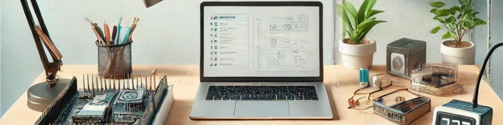

# 👋 Hi, I'm Anis Jallali  

🎓 **B.Eng. Technische Informatik – Embedded Systems**  
📍 Berlin, Germany  
💡 Passionate about embedded systems, automation, and hardware-level programming  

---

### 🧠 About Me  
- ⚙️ Focus: Embedded Systems · Firmware Development · Control & Automation  
- 💻 Experience with STM32 (ARM Cortex-M), RTOS, VHDL, and Embedded Linux  
- 🌱 Currently learning: OpenAMP · Edge AI · Distributed Real-Time Systems  
- 🤝 Open to: Working-student roles, internships, and collaborative engineering projects  

---

### 🧰 Tech Stack  
**Languages:** C / C++, Python, VHDL, Assembly, SQL  
**Hardware & Platforms:** STM32, FPGA, RTOS, Arduino, Embedded Linux  
**Tools:** Git, UML, MATLAB/Simulink, Quartus/ModelSim, LaTeX, Vim, Excel  

---

### 🚀 Featured Projects  

**🧩 STM32 Real-Time Sensor System**  
Real-time sensor data acquisition system using ADC, UART, and RTOS task scheduling.  
→ *Technologies:* C, FreeRTOS, STM32CubeIDE  

**🔶 FPGA Logic Controller**  
VHDL-based digital circuit design and simulation with Quartus & ModelSim.  
→ *Technologies:* VHDL, FPGA, ModelSim  

**⚙️ PID Control Simulation**  
MATLAB/Simulink model for stabilizing dynamic systems using control theory.  
→ *Technologies:* MATLAB, Simulink  

**🤖 Robotic Object Detection**  
Sensor-based robotic system with simple object recognition logic.  
→ *Technologies:* Python, Embedded C  

---

### 📈 GitHub Stats  

  

---

### 📫 Contact  
📧 **Email:** s90499@bht-berlin.de  
🔗 **LinkedIn:** [linkedin.com/in/anis-jallali-7b831620b](https://linkedin.com/in/anis-jallali-7b831620b)  
💻 **GitHub:** [github.com/Anice-33](https://github.com/Anice-33)

---

